# LOCALISEM — Scalable Mobile Information & Prevention Platform

Technical case study of a mobile-first platform designed to provide information, prevention resources, reporting capabilities and operational management related to missing persons.

LOCALISEM is evolving toward a more scalable product architecture composed of:

- an optimized **mobile application** for end users,
- a dedicated **administration application (`localisem-admin`)**,
- a robust and independent **NestJS backend**,
- a dedicated **PostgreSQL database**,
- and a set of **platform services and external integrations** for notifications, maps, routing and regional information.

> **Source code notice**
>
> This repository contains technical documentation, architecture and selected visual material only.
> The production source code is private and is not included in this repository.

---

## Contents

- [Overview](#overview)
- [Product Architecture](#product-architecture)
- [Product Components](#product-components)
  - [Mobile Application](#mobile-application)
  - [Administration Platform — localisem-admin](#administration-platform--localisem-admin)
  - [Backend Core](#backend-core)
  - [Data Layer](#data-layer)
  - [Platform Services & Integrations](#platform-services--integrations)
- [My Role](#my-role)
- [Technology Stack](#technology-stack)
- [Architecture Evolution](#architecture-evolution)
- [Backend Responsibilities](#backend-responsibilities)
- [Administration Responsibilities](#administration-responsibilities)
- [Mobile Modernization](#mobile-modernization)
- [Data Architecture](#data-architecture)
- [Notifications](#notifications)
- [Maps, Geolocation & Routing](#maps-geolocation--routing)
- [Scalability](#scalability)
- [Engineering Decisions](#engineering-decisions)
- [Technical Challenges](#technical-challenges)
- [Implementation Status](#implementation-status)
- [Platform Screenshots](#platform-screenshots)
- [What This Project Demonstrates](#what-this-project-demonstrates)
- [Key Takeaways](#key-takeaways)
- [Repository Scope](#repository-scope)
- [Author](#author)

---

## Overview

LOCALISEM is a mobile information and prevention platform focused on missing-person cases and related reporting workflows.

The product is not treated as a single mobile application. Its long-term architecture is designed as a complete platform in which different clients consume the same application core and business rules.

The architecture is organized around five main areas:

1. **Mobile App** — end-user experience.
2. **`localisem-admin`** — institutional and operational administration.
3. **NestJS Backend** — business logic, API contracts and access control.
4. **PostgreSQL** — independent application persistence.
5. **Services & Integrations** — notifications, maps, geolocation, routing and external information.

The modernization effort focuses on strengthening all of these components while preserving the value of the existing product.

<p align="center">
  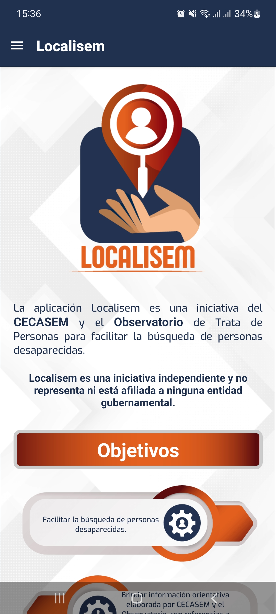
</p>

---

## Product Architecture

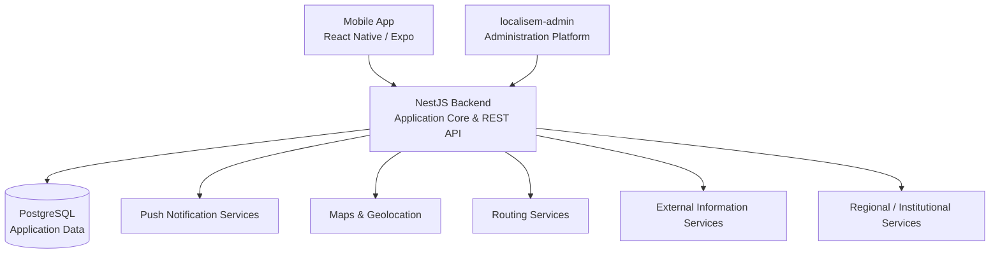

Both application clients — mobile and administration — consume the same backend.

This keeps business rules, permissions, validation and data access centralized instead of duplicating logic between different applications.

---

## Product Components

### Mobile Application

The mobile client is designed for end users and concentrates the public-facing product experience.

Its responsibilities include areas such as:

- Access to missing-person information
- Search and consultation
- Case detail visualization
- Reporting workflows
- Geographic context
- Alerts and notifications
- External information access
- Future regional and routing functionality

The mobile application is being maintained as a modern Android application with updated dependencies, build tooling and compatibility requirements.

---

### Administration Platform — `localisem-admin`

LOCALISEM includes a dedicated administration application for institutional and operational workflows.

`localisem-admin` consumes the same backend used by the mobile client, but exposes administrative capabilities according to user roles and permissions.

Its responsibilities include areas such as:

- Missing-person record management
- Report review and management
- User administration
- Content management
- Notification management
- Platform configuration
- Operational workflows
- Data review and maintenance

This separation avoids mixing administrative functionality into the end-user mobile application.

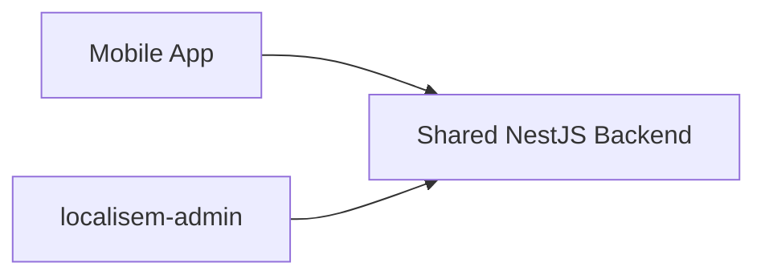

The two clients have different user experiences but share the same application core.

---

### Backend Core

The NestJS backend acts as the central application layer.

It is responsible for:

- Authentication
- Authorization
- Users and roles
- Missing-person records
- Reports
- Administrative workflows
- Notifications
- Geographic logic
- External integrations
- Data validation
- Business rules
- API contracts
- Access to the persistence layer

The backend is intentionally independent from the mobile client and the administration interface.

That separation allows each application to evolve without duplicating core logic.

---

### Data Layer

PostgreSQL is the target application-owned persistence layer.

The database is designed to provide:

- Independent data ownership
- Relational integrity
- Versioned migrations
- Better query control
- Structured entity relationships
- Safer backend evolution
- Support for multiple application clients
- Reduced coupling to a CMS database

The database becomes part of LOCALISEM's own architecture rather than an implementation detail inherited from another platform.

---

### Platform Services & Integrations

The core platform can interact with specialized or external services without embedding those responsibilities directly into the mobile application.

Examples include:

- Push notification providers
- Maps and geolocation services
- Routing services
- External information APIs
- Regional alert services
- Institutional integrations
- Future interoperability services

Conceptually:

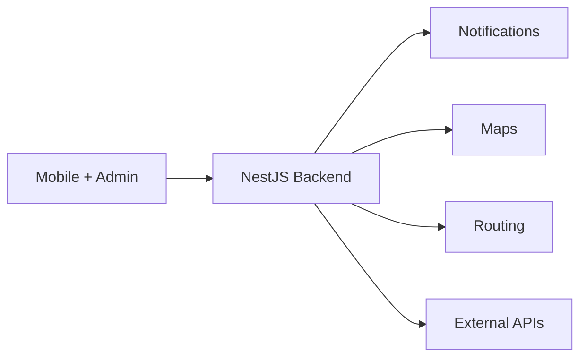

This integration model keeps the mobile application focused on the user experience while the backend coordinates external systems.

---

## My Role

My participation spans several layers of the platform:

- Mobile application modernization
- Backend architecture
- API design
- Database modernization
- Migration planning
- Android compatibility updates
- Administration platform integration
- External service integrations
- Notification workflows
- Technical maintenance
- Architecture evolution
- Production readiness
- Scalability planning
- Product technical evolution

---

## Technology Stack

### Mobile

- React Native
- Expo SDK 54
- TypeScript
- Hermes
- Android API 36
- EAS Build

### Backend

- NestJS
- TypeScript
- REST API
- Authentication and authorization
- Modular architecture
- Application services

### Administration

- Dedicated `localisem-admin` client
- Shared backend API
- Role-based operational workflows
- Administrative management interfaces

### Data

- PostgreSQL
- Relational modeling
- Versioned migrations
- Data integrity rules
- Application-owned persistence

### Services & Integrations

- Push notifications
- Maps
- Geolocation
- Routing
- External information sources
- Regional services
- Institutional integrations

### Infrastructure

- Linux-based deployment
- Environment-based configuration
- API deployment
- Production mobile builds
- EAS Build workflows

---

## Architecture Evolution

The original mobile product relied on a WordPress-based environment with a custom API.

That architecture provided a functional starting point, but the mobile product remained coupled to infrastructure whose primary purpose was content management.

The modernization progressively moves LOCALISEM toward an application-owned architecture.

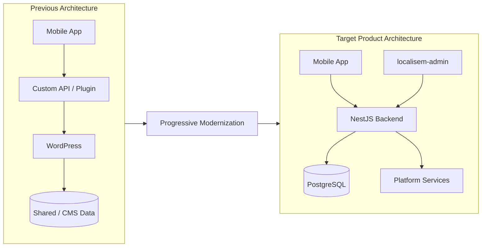

The migration is therefore not the product itself.

It is a technical transition toward a more maintainable, independent and extensible platform.

---

## Backend Responsibilities

The backend is the shared application core.

A conceptual module structure can be represented as:

```text
NestJS Backend
│
├── Authentication
├── Authorization
├── Users
├── Roles / Permissions
├── Missing Persons
├── Reports
├── Content / Information
├── Notifications
├── Geographic Services
├── Integrations
├── Administration API
├── Validation
└── Business Logic
```

Centralizing these responsibilities provides several advantages:

- A single source of business rules
- Consistent validation
- Centralized permissions
- Reusable APIs
- Easier integration of new clients
- Better testing and maintainability

---

## Administration Responsibilities

`localisem-admin` is not a replacement for the backend.

It is an administration client that uses backend capabilities through authorized API operations.

Conceptually:

```text
localisem-admin
│
├── Operational Dashboard
├── Missing-person Management
├── Reports Management
├── User Administration
├── Content Management
├── Notification Management
├── Platform Configuration
└── Operational Workflows
         │
         ▼
    NestJS REST API
```

The backend remains responsible for security, validation and business logic.

This is especially important because administrative permissions should never depend only on what the frontend displays.

---

## Mobile Modernization

The mobile application has been updated to a modern Android-compatible foundation.

### Current mobile foundation

- Expo SDK 54
- React Native
- TypeScript
- Hermes
- Android API 36
- EAS Build

The modernization process included compatibility work across:

- Expo dependencies
- React Native requirements
- Android build targets
- Native modules
- Hermes runtime
- Production builds
- Notification behavior
- Android platform requirements

A mobile modernization is not only a dependency upgrade.

The application must remain functional while adapting to changes in the Android ecosystem, native packages and build tooling.

---

## Data Architecture

The new persistence layer is designed specifically around LOCALISEM's application requirements.

Instead of relying indefinitely on a CMS-oriented database, the platform can define its own entities and relationships.

Examples of conceptual data areas include:

```text
Users
│
├── Roles
└── Preferences

Missing Persons
│
├── Case Information
├── Geographic Information
├── Status
└── Related Content

Reports
│
├── Reporter / Context
├── Case Relationship
├── Location
└── Workflow Status

Notifications
│
├── User / Audience
├── Type
├── Region
└── Delivery State

Platform Configuration
```

The exact production schema remains private.

The important architectural decision is that the data model belongs to the application and can evolve with the product.

---

## Notifications

Notifications are an important platform capability because relevant information can be time-sensitive and geographically contextual.

The architecture is prepared to support workflows such as:

- Push notifications
- Regional alerts
- Case-related updates
- Operational notifications
- User-targeted notifications
- Administrative communication

Conceptually:

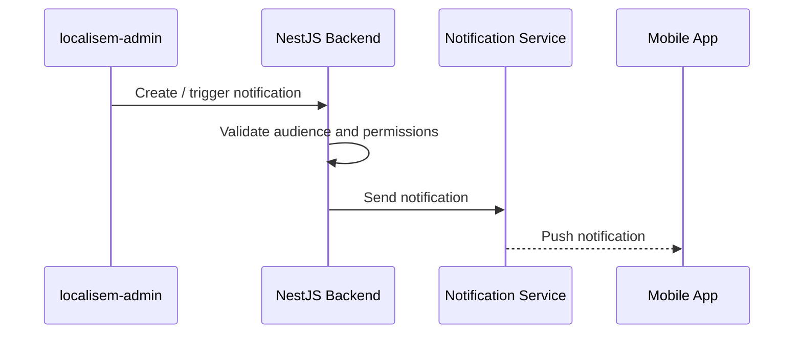

Notification rules remain controlled by the backend rather than being implemented independently in each client.

---

## Maps, Geolocation & Routing

Geographic functionality can support both information access and future service evolution.

The architecture can integrate:

- Map visualization
- User geolocation
- Geographic context for records
- Regional information
- Route calculation
- Safe routing or contextual navigation features

Routing can be implemented through a dedicated service such as OSRM or another compatible provider, depending on product requirements.

These capabilities are treated as integrations around the backend rather than hardcoded directly into the application architecture.

---

## Scalability

Scalability in LOCALISEM is considered in several dimensions.

### Application scalability

Different applications can use the same backend:

```text
Mobile App ───────┐
                  │
                  ▼
              Backend
                  ▲
                  │
Admin Platform ───┘
```

Future clients can be added without rebuilding core business logic.

### Data scalability

A dedicated PostgreSQL database provides better control over:

- Indexing
- Query optimization
- Entity relationships
- Migration strategy
- Integrity rules

### Integration scalability

External services connect through backend-defined integration points.

This prevents the mobile application from becoming responsible for every external dependency.

### Product scalability

New functionality can be added to one layer without requiring a complete rewrite of the others.

This is one of the main goals of the modernization.

---

## Engineering Decisions

### One Backend, Multiple Clients

The mobile application and `localisem-admin` have different user experiences but depend on the same business domain.

Using a shared backend avoids duplicating:

- Permissions
- Validation
- Data access
- Notification rules
- Business logic

---

### Independent Backend

The application backend should represent LOCALISEM's own domain instead of inheriting the limitations of a CMS.

NestJS provides a modular structure for growing the platform while maintaining clear responsibilities.

---

### Dedicated PostgreSQL Database

Application persistence is moved toward a database designed for the product.

This gives greater control over:

- Schema design
- Relationships
- Integrity
- Migration history
- Queries
- Performance

---

### Administration as a Separate Client

Administrative workflows are structurally different from mobile end-user workflows.

Keeping `localisem-admin` separate improves:

- Interface clarity
- Security boundaries
- Maintainability
- Operational workflows
- Future evolution

---

### Progressive Modernization

The strategy is not to discard a working product simply because part of its architecture is legacy.

Modernization is performed progressively:

```text
Preserve Product Value
        +
Replace Technical Constraints
        +
Improve Architecture
        ↓
Continuous Product Evolution
```

This reduces migration risk.

---

### Integrations Behind the Backend

Whenever practical, external integrations are coordinated through the backend.

This gives the platform:

- Better credential isolation
- Centralized integration logic
- Easier provider changes
- Better logging and monitoring
- Less complexity in the mobile application

---

## Technical Challenges

### Modernizing Without Interrupting the Product

LOCALISEM already exists as a functional product.

Architectural changes therefore need to preserve existing user value while the underlying components evolve.

---

### Migrating Existing Data

Moving to an independent database requires careful treatment of existing information.

The process involves:

- Legacy model analysis
- Entity mapping
- Data transformation
- Validation
- Migration scripts
- Integrity checks
- Controlled transition

---

### Separating CMS and Application Responsibilities

A CMS is useful for managing content, but application-specific workflows eventually require their own domain model and business rules.

Separating these responsibilities improves long-term maintainability.

---

### Supporting Multiple Applications

The backend must serve both mobile and administrative clients without leaking client-specific assumptions into the business core.

Clear API contracts and authorization rules are therefore essential.

---

### Android Ecosystem Changes

Android target requirements and mobile dependencies evolve over time.

The application must remain compatible with:

- Current Android API requirements
- Expo
- React Native
- Native libraries
- Notification changes
- Build tooling

---

### Integrating New Services Safely

Maps, routing, notifications and external data sources introduce additional dependencies.

These integrations need clear boundaries so that replacing one provider does not require redesigning the entire platform.

---

## Implementation Status

The platform is evolving progressively, so this case study distinguishes current capabilities from modernization work and future integrations.

| Area | Status | Direction |
|---|---|---|
| Mobile application | Active / modernized | Continue UX, performance and feature improvements |
| Android compatibility | Updated | Maintain compatibility with current platform requirements |
| Production Android build | Available | Continuous production maintenance |
| Backend independence | Modernization | Consolidate business logic in NestJS |
| PostgreSQL application database | Modernization | Complete independent persistence and migration |
| `localisem-admin` | Platform component | Expand operational and administrative workflows |
| Notifications | Platform capability | Improve regional and targeted notification workflows |
| Maps / geolocation | Platform capability | Improve geographic integrations |
| Routing | Planned integration | Integrate routing service according to product needs |
| External services | Evolving | Add integrations through stable backend boundaries |

This distinction is intentional: planned functionality is not presented as completed functionality.

---

## Platform Screenshots

### Mobile Experience

<p align="center">
  
  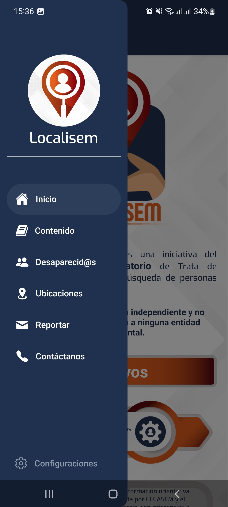
</p>

The mobile application provides access to informational content, missing-person cases, locations, reporting and contact resources.

---

### Educational Content

<p align="center">
  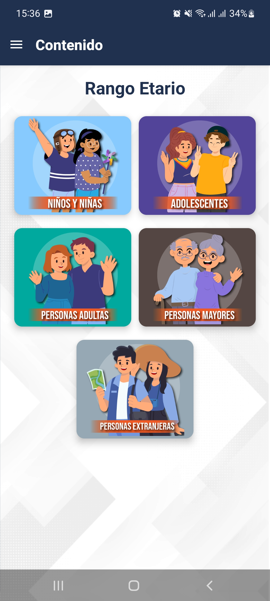
  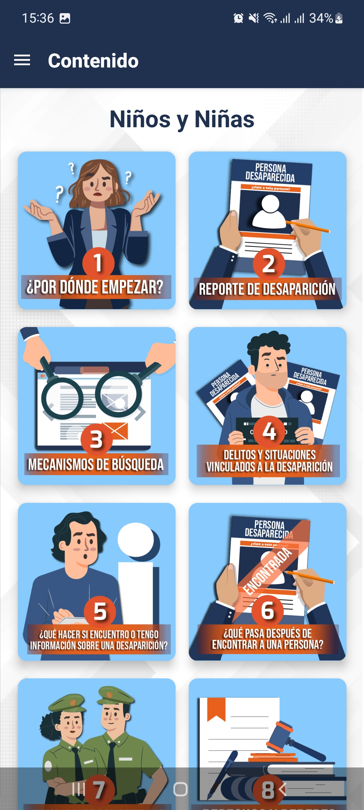
</p>

Information is organized by audience and topic to provide structured prevention and guidance resources.

---

### Missing-person Workflows

<p align="center">
  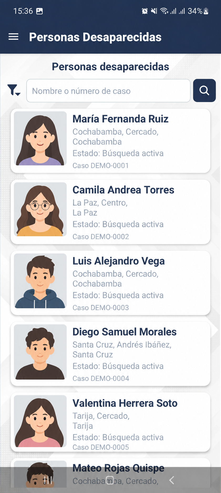
  
</p>

All personal information shown in these screenshots is fictional and used only for demonstration purposes.

---

### Reporting & Geographic Services

<p align="center">
  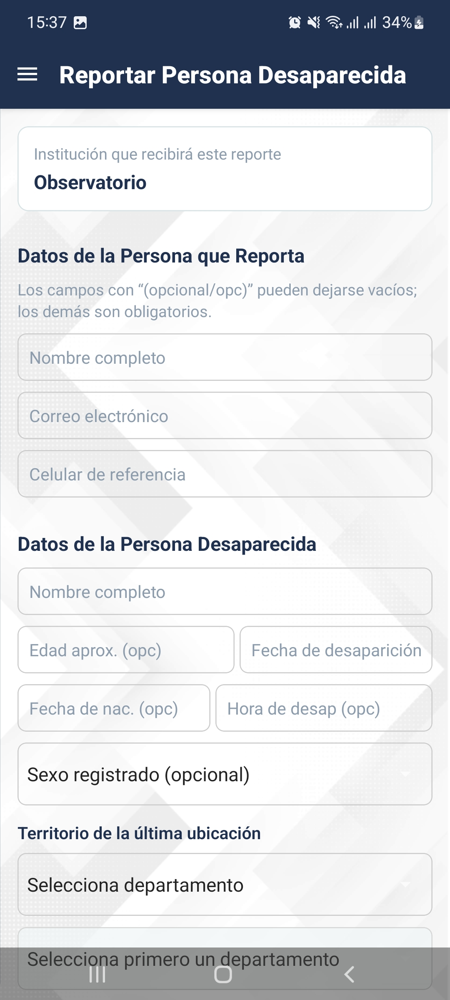
  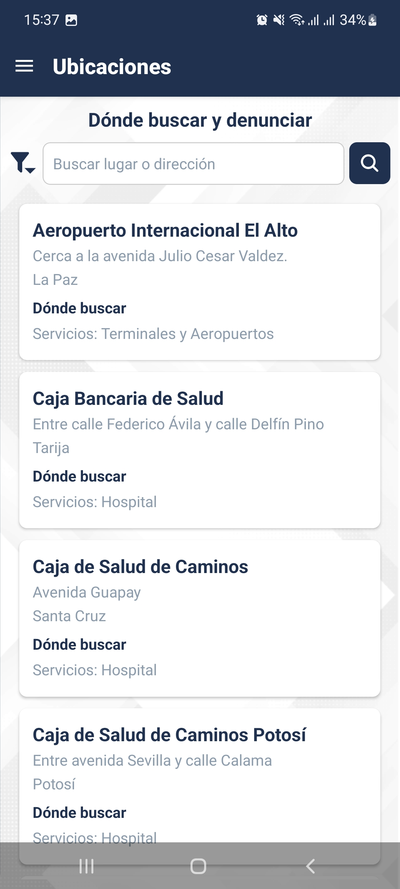
</p>

---

### Route Calculation

<p align="center">
  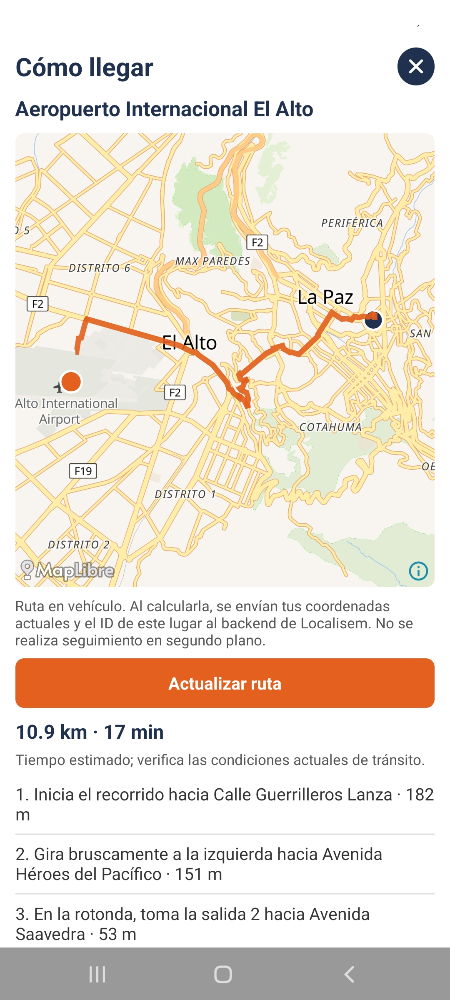
</p>

---

## What This Project Demonstrates

LOCALISEM demonstrates work across multiple areas of software engineering:

`Mobile Development`

`React Native`

`Expo`

`Android Modernization`

`Backend Architecture`

`NestJS`

`REST APIs`

`PostgreSQL`

`Administration Platforms`

`Role-based Access`

`Software Modernization`

`Architecture Migration`

`External Integrations`

`Notifications`

`Maps & Geolocation`

`Scalable System Design`

The key challenge is not simply updating technologies.

It is evolving a working product into a platform where mobile, administration, backend, data and external services can continue growing independently while remaining part of the same system.

---

## Key Takeaways

Some of the main lessons from this project include:

- A mobile product should not depend permanently on infrastructure designed for another purpose.
- A shared backend allows multiple clients to use the same business rules.
- Administration interfaces should be separated from end-user mobile experiences.
- Backend authorization must remain authoritative even when different clients expose different functionality.
- Independent persistence improves product ownership and maintainability.
- Modernization can be progressive instead of requiring a full rewrite.
- Android compatibility is an ongoing maintenance responsibility.
- External integrations are easier to evolve when they are isolated behind clear backend boundaries.
- Scalability is not only about traffic; it is also about making future change safer and easier.

---

## Repository Scope

This repository intentionally does **not** contain:

- Production source code
- Environment variables
- Credentials or API keys
- Personal user information
- Missing-person private records
- Internal server configuration
- Production database dumps
- Private migration scripts
- Administrative credentials
- Sensitive institutional information
- Private integration secrets

Its purpose is exclusively to document the platform architecture, modernization strategy, engineering decisions and technical lessons learned.

---

## Author

**Alfredo Ramos**

Software Engineer  
Full Stack · Mobile · Backend · Data · GIS · Machine Learning

GitHub: [@wolcken](https://github.com/wolcken)  
LinkedIn: [alfredoramos-dev](https://www.linkedin.com/in/alfredoramos-dev/)
